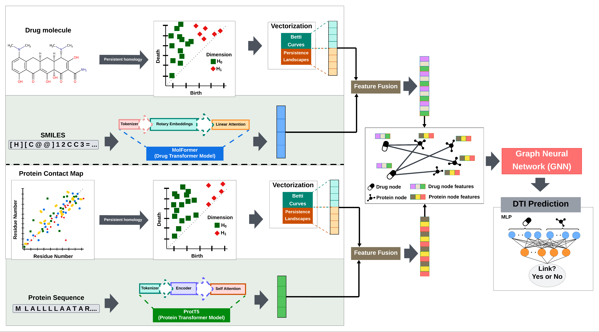

# Top-DTI: Integrating Topological Deep Learning and Large Language Models for Drug Target Interaction Prediction

---

## Top-DTI

We propose **Top-DTI** framework for predicting **Drug-Target Interaction (DTI)** by integrating  **Topological Data Analysis (TDA)** and **Large Language Models (LLMs)**. Top-DTI leverages **Persistent Homology (PH)** to extract topological features from protein contact maps and drug molecular images. Simultaneously, protein and drug LLMs generate semantically rich embeddings that capture sequential and contextual information from protein sequences and drug SMILES strings. TDA and LLM embeddings are combined through a learnable fusion mechanism that dynamically balances the contributions of topological and sequence-based features. The integrated representations are then fed into a heterogeneous **Graph Neural Network (GNN)** to learn relational information from the DTI network. Finally, the embeddings learned from the GNN are used to train a multilayer perceptron (MLP) classifier to predict DTIs.

## How to Run Top-DTI

1. **Generate 2D Representations**  
   Generate two-dimensional representations of drug molecular structures and protein contact maps to capture structural features:  
   - **Drug Images**: Generated from SMILES using the RDKit library.  
   - **Protein Contact Maps**: Created using a transformer-based contact prediction model.  
   [Run Notebook: 01_generate_images.ipynb](Notebooks/01_generate_images.ipynb)

2. **Extract Topological Features**  
   Extract topological features from drug molecular images and protein contact maps using **Persistent Homology**.  
   [Run Notebook: 02_topological_features.ipynb](Notebooks/02_topological_features.ipynb)

3. **Generate Sequence-Based Embeddings**  
   Capture sequence-based features using pre-trained **LLMs**:  
   - **ProtT5**: For protein sequences.  
   - **MoLFormer**: For drug representations.  
   [Run Notebook: 03_LLM_embeddigns.ipynb](Notebooks/03_LLM_embeddigns.ipynb)

4. **Evaluate the Model**  
   
    The embeddings generated from [Step 2: Topological Features](Notebooks/02_topological_features.ipynb) and [Step 3: Sequence-Based Embeddings](Notebooks/03_LLM_embeddigns.ipynb) are utilized to evaluate the performance of **Top-DTI** on benchmark datasets: **BioSNAP**, **Human**, and **Human Cold**:

   - [BioSNAP Dataset Evaluation: biosnap_random.ipynb](Notebooks/biosnap_random.ipynb)  
   - [Human Dataset Evaluation: human_random.ipynb](Notebooks/human_random.ipynb)  
   - [Human Cold Dataset Evaluation: human_cold.ipynb](Notebooks/human_cold.ipynb)  

  